# Agentic AI Development with Agent Framework, MCP and .NET

### Designing real-world multi-agent systems for enterprise apps with MAF, Microsoft Foundry, Aspire, MCP, A2A, AG-UI and DevUI

---

## Who is this for?

- **Software Developers, Architects and Tech Leads** building real systems on .NET.
- **Professionals transitioning into AI Engineering** who already know the web/microservices world.
- Anyone planning to **add an Agentic Layer** to existing enterprise apps — without throwing away their current stack.

> The story here is *augmenting* a working .NET application — not rewriting it.

---

## Agenda

1. AI Agents — The Paradigm Shift of Development
2. Microsoft Enterprise Stack for Agentic AI (.NET, MAF, Aspire, Foundry, Azure OpenAI)
3. Microsoft Agent Framework — what's in it
4. Your First AI Agent — what it actually contains
5. Agent Tool Use and Function Calling
6. Context and Memory — multi-turn conversation and agent sessions
7. Multi-Agent Workflows & Orchestration
8. Enterprise Workflow Design Patterns
9. Agentic RAG — Advanced Reasoning with Qdrant
10. Agent Communications & Protocols — A2A, AG-UI and MCP
11. A2A — Agent-to-Agent
12. MCP — Model Context Protocol
13. AG-UI — Talking to Humans
14. Putting it all together — EShop + Agents + MCP

---

# 1. AI Agents — The Paradigm Shift of Development

## The evolution — GenAI → AI Agents → Agentic AI

The shift isn't just *better models* — it's a change in **how much of the work the human has to drive**.


| Era            | Character                                | Human role            |
| -------------- | ---------------------------------------- | --------------------- |
| **GenAI**      | Set of rules · Passive · One-shot · Stateless | Writes every prompt   |
| **AI Agents**  | Singular goal · Active · Multi-step · Stateful | Sets the goal, watches |
| **Agentic AI** | Multi-agent · Systemic · Collaborative · Specialised | Sets the *complex* goal |

> As you move right, **human intervention drops** and **system autonomy grows** — that's the paradigm shift.

---

## From a classic app to an Agentic app

A traditional system is a static pipeline: client → API → service → DB.

An **Agentic application** adds a new layer between the user and the services — an *Agentic Layer* — where an LLM, one or more AI Agents, and shared State decide *what* to do, *which* tool to call, and *how* to coordinate. Microservices stay where they are; agents reach them through standard protocols such as **MCP** and message buses such as **RabbitMQ**.


> Client Apps talk to the Agentic Layer (LLM + AI Agents + State). The Agentic Layer talks to the existing EShop microservices (Identity, Catalog, Basket, Ordering) via MCP — backed by PostgreSQL, Redis and RabbitMQ.

---

## What is an Agent?

An **Agent** is an autonomous software entity that:

- **Perceives** its environment (input, signals, sensors, events)
- **Reasons** with an LLM as its "brain"
- **Uses Tools** to act on the outside world
- **Remembers** (short-term and long-term Memory)
- **Acts** to change the state of the environment toward a goal


### Core components

| Component       | Role                                                                |
| --------------- | ------------------------------------------------------------------- |
| **Perception** | How the agent senses the world (text, files, lab/vitals, API data) |
| **Reasoning**  | Planning + decision making, driven by the LLM                       |
| **LLM**        | The "brain" that turns context into the next action                 |
| **Tools**      | Functions / APIs / MCP servers the agent can invoke                 |
| **Memory**     | Short-term (conversation) + long-term (vector DB, files)            |
| **Action**     | The effect on the environment (API call, write, message, UI)        |

---

# 2. Microsoft Enterprise Stack for Agentic AI

## The full stack — from infrastructure to your app

A production-grade Agentic system on the Microsoft platform is a layered stack. Every layer is *replaceable*, but they're designed to work together.


```
┌──────────────────────────────────────────────────────────────────┐
│  APPLICATION DEVELOPMENT PLATFORM                                 │
│  .NET  ·  Microsoft Aspire (app lifecycle / DevOps)               │
│         ·  MAF (Agent Framework, for extensibility)               │
├──────────────────────────────────────────────────────────────────┤
│  AGENT PLATFORM & CORE LOGIC  (.NET)                              │
│  Agent Orchestration · Reasoning & Planning ·                     │
│  Tool Execution · Task Management                                 │
├──────────────────────────────────────────────────────────────────┤
│  AGENT MEMORY & KNOWLEDGE BASE                                    │
│  Short-Term Memory · Long-Term Memory · Vector DB (Qdrant)        │
├──────────────────────────────────────────────────────────────────┤
│  SERVICES & AI FOUNDATION                                         │
│  Azure OpenAI Service · Microsoft Foundry                         │
├──────────────────────────────────────────────────────────────────┤
│  INFRASTRUCTURE & DATA LAYER (AZURE)                              │
│  Compute (AKS, VMs) · Storage · Databases (Azure SQL,             │
│  Cosmos DB) · Networking                                          │
└──────────────────────────────────────────────────────────────────┘
```

### Why each layer is here

- **Aspire** — orchestrates the multi-service local + cloud dev loop and gives you the dashboard / telemetry.
- **MAF** — the extensibility model: agents, tools, workflows, protocols (A2A, AG-UI).
- **Memory layer** — separates short-term (the conversation) from long-term (vector embeddings in Qdrant).
- **Microsoft Foundry** — the advanced intelligence platform (models, evaluations, deployments, agent services).
- **Azure OpenAI** — the LLM and embedding source.
- **Azure infra** — where the whole stack actually runs.

> Pick any layer to swap (e.g. Ollama instead of Azure OpenAI, Postgres instead of Cosmos) and the layers above keep working.

---

# 3. Microsoft Agent Framework — what's in it

## MAF is more than a chat wrapper

MAF brings together the work from **Semantic Kernel** and **AutoGen** under one model — production-ready services, low-level workflows, middleware, and the DevUI for visual debugging.

Conceptually, MAF organises capabilities into six families:

| Family              | What it provides                                                                |
| ------------------- | ------------------------------------------------------------------------------- |
| **AI Services**     | Azure OpenAI, OpenAI, Foundry, HuggingFace, Anthropic, Google Gemini …          |
| **Local Models**    | Ollama, ONNX, Foundry Local Models                                              |
| **Memory Services** | Azure AI Search, Redis, MongoDB, Postgres, Qdrant, Pinecone …                   |
| **Agent Services**  | Foundry Agent Service, Bedrock, Copilot Studio, LangGraph                       |
| **Plugins**         | OpenAPI, MCP, A2A, Logic Apps                                                   |
| **GUI Frameworks**  | ChatUX, AG-UI                                                                   |
| **Filters & Identity** | OpenTelemetry, Aspire Dashboard, Entra ID                                    |

> The same agent code can mix providers from any family — that's the point of building on `Microsoft.Extensions.AI` abstractions.

---

# 4. Your First AI Agent — what it actually contains

## A Minimal Agent — visually

A minimal agent in **.NET + MAF + Aspire** still has all of the components from slide 1 — wrapped into a thin sample you can step through visually with the DevUI.

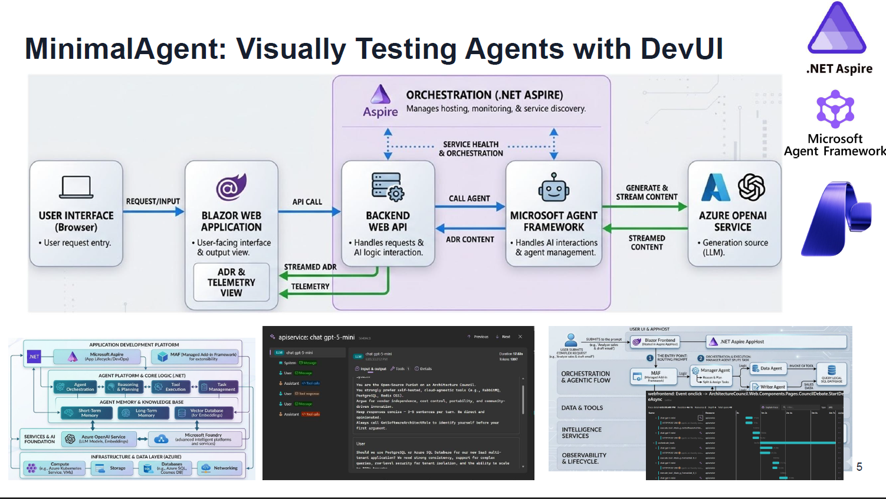

### What's in the box

- A **User Interface** (Blazor) for user input
- A **Backend Web API** that hosts the agent
- The **MAF Agent** with an LLM, a system prompt and tools
- **Azure OpenAI** as the LLM provider
- **Aspire** for orchestration, telemetry and service discovery
- **DevUI** to inspect prompts, tool calls and traces while the agent runs

> If you understand this picture, every other slide is just adding more agents, more tools or more protocols on top.

---

# 5. Agent Tool Use and Function Calling

## The Agentic Loop

In MAF, an agent is an LLM + a system prompt + a set of **function tools** (and optionally MCP tools). At runtime the agent runs an **Agentic Loop**:

1. The user sends a goal.
2. The agent sends *Request + Prompt + Context* to the LLM.
3. The LLM decides: answer directly, or call a tool / MCP server.
4. The tool executes; result is fed back to the LLM.
5. Loop continues until the task is complete.


### Two flavours of tools

| Tool flavour          | What it is                                                    | Where it runs                  |
| --------------------- | ------------------------------------------------------------- | ------------------------------ |
| **Function tools**    | A .NET method the agent can call (typed inputs and output)   | Inside the agent's own process |
| **MCP tools**         | A capability exposed by an MCP server (slide 12)             | Out of process, over MCP       |

> The LLM doesn't care which kind it's calling — to it, every tool is just a name + description + parameter schema.

---

# 6. Context and Memory in Agents

## Why memory matters

An agent without memory is just a one-shot function. Real agents need **two memory layers** living right next to the LLM — and they behave very differently.

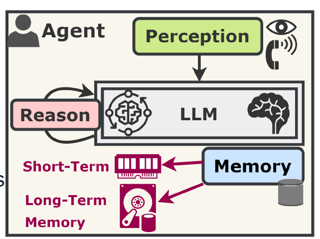

| Layer          | Lifetime           | Typical store                                  | Example                            |
| -------------- | ------------------ | ---------------------------------------------- | ---------------------------------- |
| **Short-term** | Per conversation   | Conversation thread / chat history in-process  | "What did the user just ask?"      |
| **Long-term**  | Across sessions    | Vector DB (Qdrant), document store, SQL        | "What does this user usually buy?" |

> Short-term sits in *RAM* (the running session); long-term lives on *disk* (the vector DB or a document store).

---

## Where memory sits in the Microsoft stack

Memory isn't an afterthought — it has a dedicated layer in the Microsoft Agentic stack, sitting between the agent's reasoning loop and the AI / data foundation.


> Short-term and long-term memory both live in the **Agent Memory & Knowledge Base** layer; Qdrant is the typical vector store, fed by Azure OpenAI embeddings and accessed by MAF agents.

---

## Multi-turn conversation — the Agent Session

The single most important idea behind short-term memory is the **Agent Session** — a persistent context container that lives across multiple turns.

```
   ┌──────┐        ┌────────────┐                ┌──────────────┐
   │ User │ ─────▶ │ Agent      │ ── Context ─▶ │ Azure OpenAI │
   │      │        │ Client     │   + History    │   (LLM)      │
   └──────┘        │            │ ◀── Response   └──────────────┘
                   │            │
                   │            │  Read / Append  ┌──────────────┐
                   │            │ ◀─────────────▶ │ AGENT SESSION│
                   └────────────┘                 │ (memory      │
                                                  │  container)  │
                                                  └──────────────┘
```

**Turn 1** — "Who invented the telephone?" → agent answers *"Alexander Graham Bell"*, appends to session.
**Turn 2** — "When was *he* born?" → agent reads the session, resolves *"he"* → *Bell*, answers *"March 3, 1847"*.

Without the session, Turn 2 is unanswerable. The session is what makes a chatbot a *conversation*.

### Context window vs memory

- The LLM's **context window** is finite — you cannot just stuff everything into it.
- Memory is the *strategy* for choosing what enters that window each turn: recent turns, summaries, retrieved snippets, profile facts.

> Good agents forget on purpose. The art is choosing what's worth remembering.

---

# 7. Multi-Agent Workflows & Orchestration

## The evolution of workflows

Before talking about *multi-agent* workflows, it helps to see how workflows themselves have evolved.

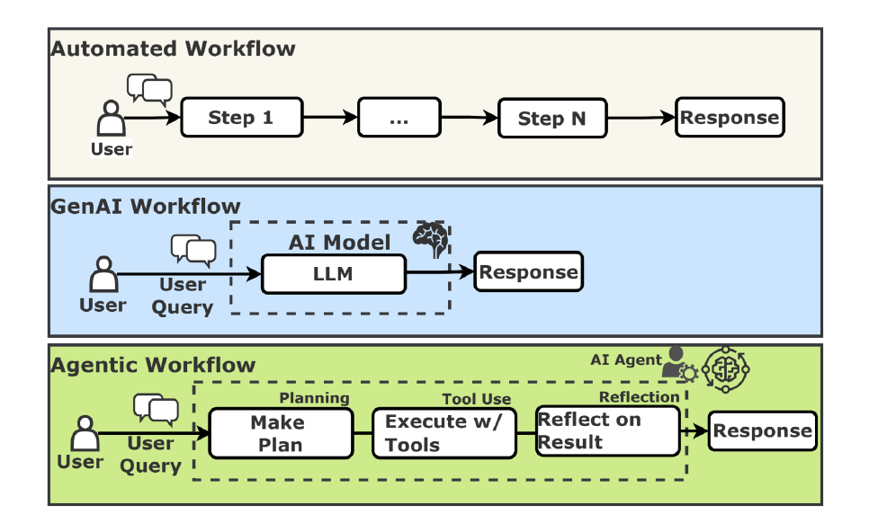

| Workflow type    | Shape                                            | What changes                                |
| ---------------- | ------------------------------------------------ | ------------------------------------------- |
| **Automated**    | Step 1 → … → Step N → Response                   | Deterministic, hard-coded                   |
| **GenAI**        | User Query → LLM → Response                      | One LLM call, no tools, no state            |
| **Agentic**      | Plan → Execute w/ Tools → Reflect → Response     | LLM in a loop with tools and self-critique |

> Agentic = Planning + Tool Use + Reflection — *all three* in one loop.

---

## Workflows — Nodes, Edges and State

A workflow is just a graph: **Nodes** are agents (or steps), **Edges** are transitions, **State** is the shared memory carried along.

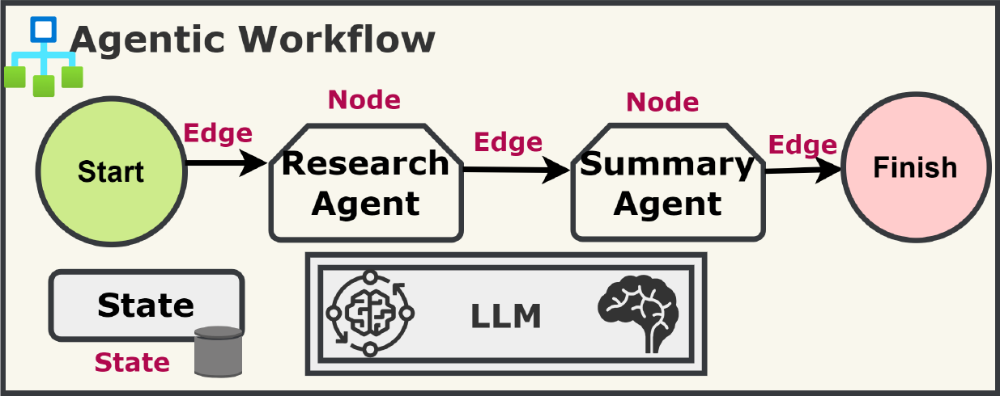

> Example: a `Research Agent` produces material, hands the state to a `Summary Agent`, which finishes the run. Replace these two with any number of nodes to build richer pipelines.

---

## From workflow to orchestrator

Once you have multiple agents, you usually need an **Orchestrator Agent** — a coordinator that takes the user goal and dispatches sub-tasks to specialist agents.

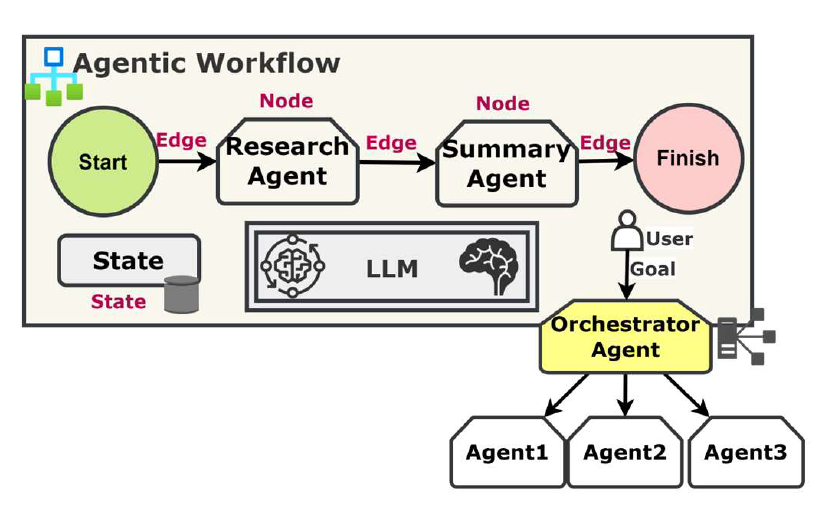

> The graph view (`Start → Agent → Agent → Finish`) and the orchestrator view (`Orchestrator → Agent1 / Agent2 / Agent3`) are two ways of drawing the same idea — one focuses on the *path*, the other on the *coordinator*.

---

## Multi-Agent example — IT Support Routing

A practical example: a **Triage Agent (Router)** classifies the request, then hands off to a **Hardware specialist** or **Software specialist**. The resolved state is returned to the user.


> Routing + specialists is the most common multi-agent pattern in real products — it scales from 2 agents to dozens.

---

# 8. Enterprise Workflow Design Patterns

## The five canonical patterns

There is no single "right shape" for a multi-agent system. MAF (and the broader ecosystem) provides several first-class patterns:

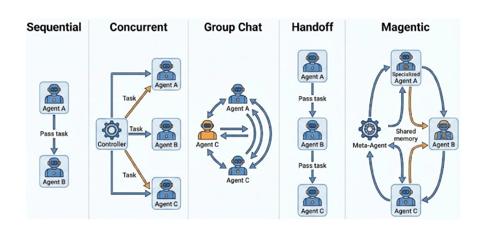

| Pattern        | When to use                                                                   |
| -------------- | ----------------------------------------------------------------------------- |
| **Sequential** | A linear pipeline — output of A feeds B                                       |
| **Concurrent** | Fan-out work to several agents and aggregate                                  |
| **Group Chat** | Agents discuss with each other to converge on an answer                       |
| **Handoff**   | One agent delegates control entirely to a specialist                          |
| **Magentic**   | A Meta-Agent coordinates specialists, often with a *task progress ledger* and a *human check* (Sticky Router) |

---

## The same patterns in MAF

The same five patterns are first-class in MAF's `MinimalAgent` workflow templates — you don't pick them in a UML diagram, you pick them as a building block in the framework.


> Start from the pattern that matches your problem shape, then customise nodes and tools.

---

## Human-in-the-Loop — keeping people in control

Agents are powerful but not infallible. **Human-in-the-Loop (HITL)** keeps a human in the decision path for high-risk actions: a clinician approves an agent's suggestion, an operator approves a refund, etc.

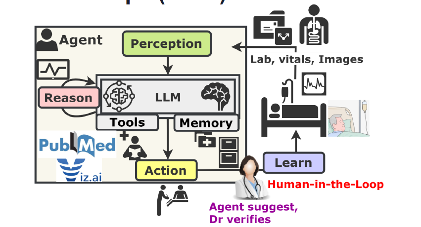

> Pattern: the agent *suggests*; the human *verifies*. The verification itself becomes training signal ("Learn").

---

## Human-in-the-Loop — approval workflow

A more transactional version of HITL: the orchestrator *intercepts* a tool call, pauses on a rule (e.g. amount > $1000), and asks a human operator to **Approve / Deny** before execution.

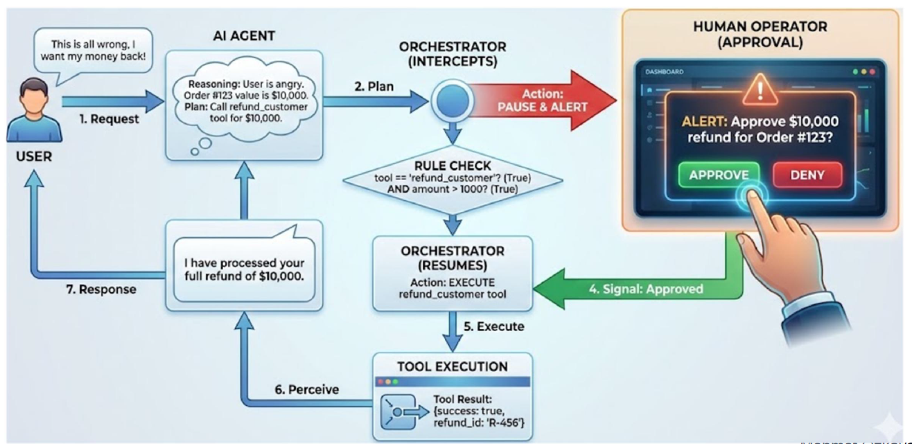

> The agent perceives the human signal, then resumes the loop — no code path bypasses approval.

---

# 9. Agentic RAG — Advanced Reasoning with Qdrant

## Classic RAG — the baseline

Before getting to *agentic* RAG, here is the classic RAG pipeline: an offline **ingestion** phase that fills the vector DB, and a runtime **retrieval + generation** phase that answers the user.

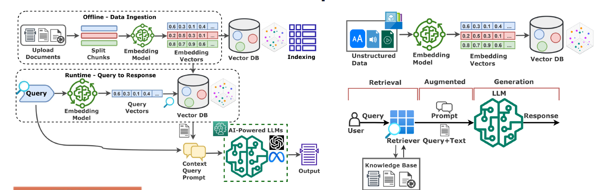

| Phase                   | Steps                                                                 |
| ----------------------- | --------------------------------------------------------------------- |
| **Offline ingestion**   | Documents → split chunks → embed → store vectors → index             |
| **Runtime retrieval**   | Query → embed → vector search → top-K context                         |
| **Generation**          | Stuff context into prompt → LLM → answer                              |

> Classic RAG is a *one-shot pipeline*: same K, same index, same query rewrite — every time.

---

## From classic RAG to Agentic RAG

**Agentic RAG** treats retrieval as a **tool** the agent decides *when* and *how* to use:

| Classic RAG                   | Agentic RAG                                          |
| ----------------------------- | ---------------------------------------------------- |
| One retrieval per query       | Multiple retrievals, iterative, until satisfied      |
| Fixed query                   | Agent rewrites the query, decomposes sub-questions   |
| One index                     | Agent picks among several stores / MCP resources     |
| No verification               | Agent critiques retrieved context, re-queries if weak |
| No planning                   | Plan → retrieve → reason → act → verify → loop       |

---

## The Agentic RAG workflow

Unlike classic RAG, Agentic RAG is a *loop with decision points*. The agent checks memory first, decomposes the query into sub-tasks, picks the right tools, then reflects on the result before answering.


| Step                  | What happens                                                       |
| --------------------- | ------------------------------------------------------------------ |
| **Answer Before?**    | Memory check — has the agent already answered this?               |
| **Plan & Reason**     | Decompose the user query into sub-queries (Task 1 … N)             |
| **Tool Use**          | Route each sub-query — vector search, web search, function tool…   |
| **Reflection**        | Validate retrieved evidence, retry weak retrievals                 |
| **Generate Response** | Synthesise a cited answer for the UI                               |

> Memory, planning, tool use and reflection are all *parts of the same loop* — that's what makes RAG "agentic".

---

## Where Qdrant fits

Agentic RAG in MAF leans on **Qdrant** (or any compatible vector DB) for the long-term knowledge layer.

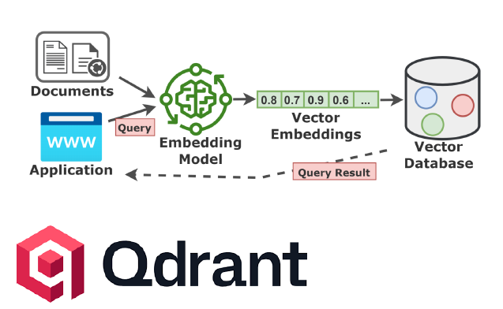

- **Documents** and **application queries** both pass through the same embedding model.
- The **vector database** (Qdrant) stores document embeddings and serves nearest-neighbour lookups.
- The query embedding is matched against the stored vectors; results come back as **Query Result** for the agent to reason over.

### What makes it *agentic*

- The agent **decides** when to query Qdrant vs answer from context.
- The agent can **refine the query** (rewrite, expand, decompose).
- The agent can call **multiple sources** — Qdrant for docs, SQL for orders, MCP for live APIs.
- The agent can **verify and re-retrieve** if the retrieved context doesn't look sufficient.

> Agentic RAG = an agent whose toolbox includes *search* — Qdrant is just one of those tools.

---

# 10. Agent Communications & Protocols

## An Agent talks to three different worlds

Modern agents need three categories of communication, each with its own protocol:

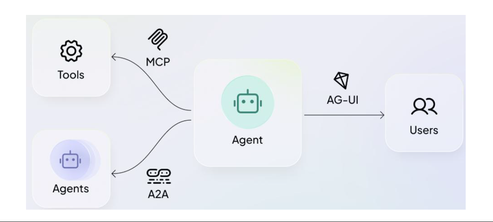

| Direction         | Protocol   | Purpose                                                |
| ----------------- | ---------- | ------------------------------------------------------ |
| Agent ↔ **Tools**  | **MCP**    | Standardised access to tools, resources and prompts    |
| Agent ↔ **Agents** | **A2A**    | Agent-to-agent collaboration across orgs / frameworks |
| Agent ↔ **Users**  | **AG-UI** | Streaming UI events between agent and frontend         |

---

## Backend vs Frontend protocols

A2A / ACP are **machine-to-machine** — humans never see those payloads. **AG-UI** is the bridge to the human: structured JSON events the frontend renderers turn into a visual chat or dashboard.

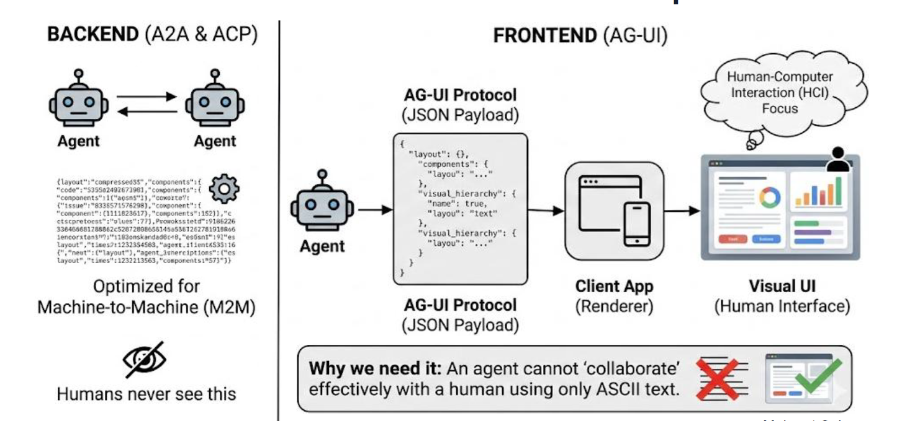

> Why AG-UI? An agent cannot *collaborate* effectively with a human using only raw ASCII text — the UI needs structured events for streaming, tool calls, citations, approvals.

---

# 11. A2A — Agent-to-Agent

## What A2A solves

A2A is a vendor-neutral protocol so an agent built on **Google ADK** can talk to one built on **MAF** (or any other framework) across organisational and technological boundaries. Each agent still uses **MCP** locally to reach its own APIs and enterprise apps.

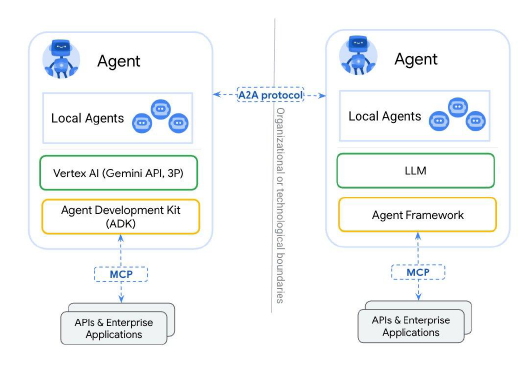

### The Agent Card — how agents discover each other

Every A2A-compliant agent publishes a public **Agent Card** at a well-known URL. It describes:

- **Name & Provider** — who runs the agent
- **Capabilities** — e.g. streaming, push notifications
- **Skills** — named operations with their input/output schemas
- **Authentication** — bearer token, OAuth, key, etc.

> The Agent Card is to agents what `swagger.json` is to REST APIs — the contract that makes interop possible.

---

# 12. MCP — Model Context Protocol

## Why MCP — Before vs After

Before MCP, every agent ↔ tool wiring was bespoke. M agents × N tools = M×N integrations. With MCP, every tool exposes a standard interface — the agent talks to *one* protocol and reaches *many* tools.


> MCP is for tools what USB-C is for devices — one cable, many peripherals.

---

## MCP Architecture — Host, Client, Server

MCP defines three roles:

- **Host** — the application the user runs (VS Code, Claude Code, an MAF app)
- **Client** — the MCP protocol speaker embedded in the Host (one per server)
- **Server** — the process that exposes Tools / Resources / Prompts


> One Host can hold many Clients; each Client speaks MCP to exactly one Server.

---

## The four layers of an MCP call

A useful mental model: every MCP interaction crosses four layers.

| #  | Layer      | Role                                  | Example                                     |
| -- | ---------- | ------------------------------------- | ------------------------------------------- |
| 1  | **Host**    | The application the user actually runs | VS Code, Claude Code, MAF app              |
| 2  | **Bridge**  | The MCP protocol itself                | JSON-RPC over stdio / HTTP+SSE              |
| 3  | **Adapter** | The MCP server — translates protocol to a backend | GitHub MCP server, SQL MCP server   |
| 4  | **Reality** | The actual data source or API          | GitHub API, a database, a file system       |

> Each layer can be swapped independently — change the data source without changing the Host.

---

## Host / Client / Server — local **and** remote

MCP works the same way whether the server runs locally (stdio) or remotely (SSE / HTTP).

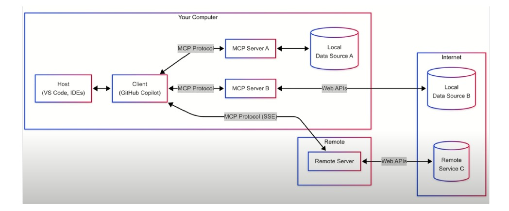

### Transport choices

| Transport          | When it's used                          | Notes                                  |
| ------------------ | --------------------------------------- | -------------------------------------- |
| **stdio**          | Local servers spawned as child processes | Lowest overhead, simplest auth         |
| **HTTP + SSE**     | Remote servers reachable over the network | Streamable, supports auth headers      |
| **Streamable HTTP** | Newer remote transport (single endpoint) | Future direction for cloud-hosted MCP |

> All transports carry the same **JSON-RPC** message shape — only the pipe changes.

---

## MCP Capability — Tools and Resources

An MCP server exposes three kinds of capabilities. The first two are:

- **Tools** — *callable* actions (functions the LLM can invoke)
- **Resources** — *readable* data (files, records, contextual blobs)


> Tools change the world; Resources describe it. The client fetches resources to give the LLM context, then invokes tools to act.

---

## MCP Capability — Tools and Prompts

The third primitive is **Prompts** — *reusable prompt templates* the server offers to the client. The client picks a prompt, refines it, and then calls a tool driven by that refined prompt.


> Prompts are how a server says *"here is the right way to ask me to do X"*.

---

## Multi-Server MCP

A single client can fan out to multiple MCP servers — e.g. a `Weather server` for forecasts and a `Task server` for the user's todo list — and combine their resources and tools in one conversation.


> This is how agents compose capabilities from independent vendors without N×M glue code.

---

## End-to-end — MAF Agent + MCP

A realistic flow: an MAF `AIAgent` (Release Manager) uses MCP tools (`get_commits`, `search_repo`) backed by a **local GitHub MCP Server** that calls the GitHub API. The agent interprets the user prompt, picks tools, executes them, and synthesises a markdown release note.

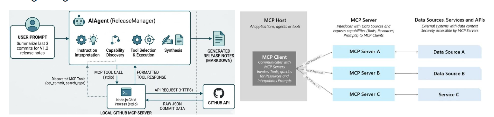

> The same pattern scales to any data source: SQL, files, internal APIs, SaaS systems.

---

# 13. AG-UI — Talking to Humans

## What AG-UI brings

AG-UI is the protocol the agent uses to **stream structured events** to the frontend: tokens, tool calls, citations, approvals, state updates. The frontend renders them as a rich UI instead of parsing raw text.


### The conversation, conceptually

1. **User message (POST)** — the frontend sends a normal HTTP request to the backend agent.
2. **Cognitive logic** — the backend agent reasons and may call tools or the LLM.
3. **AG-UI streaming (SSE)** — the agent emits a stream of structured events back to the frontend.
4. **State sync** — a thread ID and application state stay synchronised on both ends.

### Common AG-UI event categories

| Event category   | What it carries                                  |
| ---------------- | ------------------------------------------------ |
| **Text delta**   | Streaming token chunks                           |
| **Tool call**    | Agent decided to call a tool, with arguments    |
| **Tool result**  | Tool returned a value the UI can render          |
| **State update** | Shared workflow state changed                    |
| **Approval**     | Agent asks the user to approve / deny something  |

> The frontend opens a streaming connection, the agent emits events as it works — no more "spinner until done".

---

# 14. Putting it all together

## EShop + Agentic Layer + MCP

Bringing back the opening picture — now every piece has a name:

- **Client Apps** speak to the **Agentic Layer** (HTTPS / AG-UI events).
- The **Agentic Layer** runs MAF agents over an LLM, holds shared State, and exposes tools.
- Agents reach **EShop microservices** (Identity, Catalog, Basket, Ordering) through **MCP** servers.
- Microservices keep their existing stack: **PostgreSQL**, **Redis**, **Keycloak**, **RabbitMQ**.
- AI backing services (Azure OpenAI / Ollama / Foundry models + **Qdrant** for vectors) live beside the microservices.
- Agents collaborate with external partner agents via **A2A**.
- Humans see the work stream via **AG-UI**.


---

## Takeaways

- An **Agent** = Perception + Reasoning (LLM) + Tools + Memory + Action.
- The **Microsoft Enterprise Stack** layers your app, MAF, the agent core, memory, AI services (Azure OpenAI, Foundry) and Azure infrastructure.
- **Memory** has two layers: short-term *Agent Session* (automatic) and long-term stores like **Qdrant** (explicit tools).
- **Design patterns** (Sequential, Concurrent, Group Chat, Handoff, Magentic, HITL) cover almost every real workflow.
- **Agentic RAG** = retrieval as a tool inside the agentic loop, not a fixed pipeline — Qdrant is the typical vector store.
- **Three protocols** matter:
  - **MCP** — agent ↔ tools (Host · Bridge · Adapter · Reality)
  - **A2A** — agent ↔ agents (Agent Card + Skills)
  - **AG-UI** — agent ↔ users (SSE event stream)
- **MCP** removes M×N integration sprawl with a single host/client/server contract and three primitives: **Tools**, **Resources**, **Prompts**.

> Build small, observe with Aspire / DevUI, then scale out with multi-agent workflows, MCP, A2A and AG-UI.

---

# Thanks!

### Questions?
